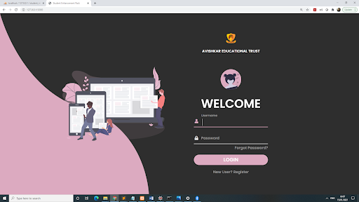

# Student Enhancement Pack

Student Enhancement Pack is a website for school students to always be on track in terms of academics, aptitude, and get constant support through teahcer bot.


## Features
Here a student gets
- Individual attention from teacher bot
- Can take down the notes for his/her reference Have a section to practise quizzes, puzzles etc. on aptitude to improve aptitude without getting bored
- Presence of task manager which helps students to improve in academics by doing daily tasks
- Separate section for practise questions to go through important questions based on subjects


## Tech Stack

**Client:** HTML, CSS, Bootstrap

**Server:** Python, Flask

**Bot:** ChatterBot (Python Library)


## Installation

Fork the repo and clone it

```bash
git clone https://github.com/Bhargavi09/StuEnchance.git
```
Create a virtual environment (env) to install the libraries

```bash
python -m venv env
env\Scripts\activate
```
Install the requirements
```bash
python install -r requirements.txt
```
## Screenshot

